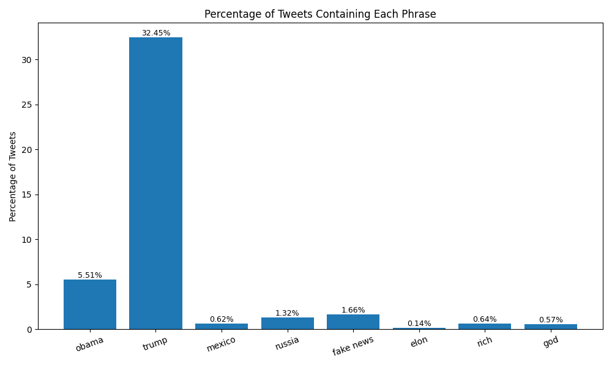

# lab-markdown
lab-markdown

# Trump Tweet Keyword Analysis

This project analyzes President Trump's tweets from 2009–2021 to count how often he uses specific keywords.

##  Keyword Frequency Table

|             phrase | percent of tweets |
| ------------------ | ----------------- |
|              obama | 05.51             |
|              trump | 32.45             |
|             mexico | 00.62             |
|             russia | 01.32             |
|          fake news | 01.66             |
|               elon | 00.14             |
|               rich | 00.64             |
|                god | 00.57             |

## Bar Chart

This chart shows how often Trump used each phrase in his tweets from 2009–2021.
